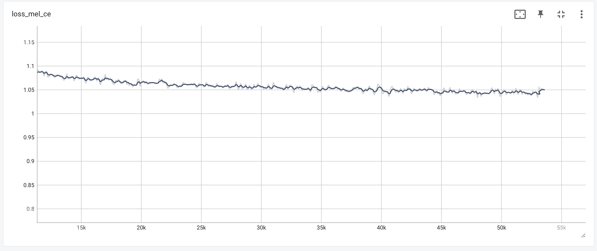
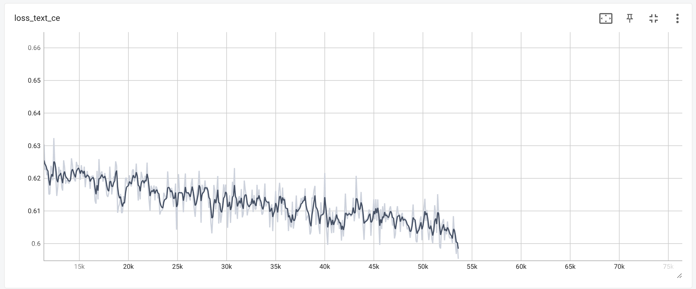

---

<div align="center"><h1 align="center">~ Tansen ~</h1></div>


<p align="center"><i>Democratizing access to LLMs for the open-source community.<br>Let's advance AI, together. </i></p>

---


## 🎉 Tansen 

Tansen is a text-to-speech program built with the following priorities:

1. Strong multi-voice capabilities.
2. Highly realistic prosody and intonation.
3. speaking rate control

<h2 align="left">🎧 Demos </h2>

[](http://bud.studio)
[](http://bud.studio)

### Random Voices

[random_0_0.webm](https://github.com/BudEcosystem/Tansen/assets/4546714/9a6ce191-2646-497e-bf48-003f2bf0bb8d)

[random_0_1.webm](https://github.com/BudEcosystem/Tansen/assets/4546714/87bf5f7c-ae47-4aa4-a110-b5c9899e4446)

[random_0_2.webm](https://github.com/BudEcosystem/Tansen/assets/4546714/5549c464-c670-4e7a-987c-c5d79b32bf4b)

<h2 align="left">💻 Getting Started on GitHub </h2>

Ready to dive in? Here's how you can get started with our repo on GitHub.

<h3 align="left">1️⃣ : Clone our GitHub repository</h3>

First things first, you'll need to clone our repository. Open up your terminal, navigate to the directory where you want the repository to be cloned, and run the following command:

```bash
conda create --name Tansen python=3.9 numba inflect
conda activate Tansen
conda install pytorch torchvision torchaudio pytorch-cuda=11.7 -c pytorch -c nvidia
conda install transformers=4.29.2
git clone https://github.com/BudEcosystem/Tansen.git
cd Tansen
```

<h3 align="left">2️⃣ : Install dependencies</h3>

```bash
python setup.py install
```

<h3 align="left">3️⃣ : Generate Audio</h3>

### do_tts.py

This script allows you to speak a single phrase with one or more voices.

```shell
python do_tts.py --text "I'm going to speak this" --voice random --preset fast
```

### read.py

This script provides tools for reading large amounts of text.

```shell
python Tansen/read.py --textfile <your text to be read> --voice random
```

This will break up the textfile into sentences, and then convert them to speech one at a time. It will output a series
of spoken clips as they are generated. Once all the clips are generated, it will combine them into a single file and
output that as well.

Sometimes Tansen screws up an output. You can re-generate any bad clips by re-running `read.py` with the --regenerate
argument.

Intrested in running as as API ?

### 🐍 Usage in Python

Tansen can be used programmatically :

```python
reference_clips = [utils.audio.load_audio(p, 22050) for p in clips_paths]
tts = api.TextToSpeech(use_deepspeed=True, kv_cache=True, half=True)
pcm_audio = tts.tts_with_preset("your text here", voice_samples=reference_clips, preset='fast')
```

## Loss Curves

<p align="center">
 
 <span>loss_mel_ce</span>
<p>

<p align="center">
 
 <span>loss_text_ce</span>
<p>


## Training Information

Device : A Single A100

Dataset : 876 hours
